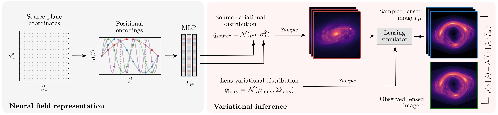

# Strong Lensing Source Reconstruction Using Continuous Neural Fields

[Siddharth Mishra-Sharma](smsharma@mit.edu) and [Ge Yang](geyang@csail.mit.edu)

[](https://opensource.org/licenses/MIT)
[](https://arxiv.org/abs/2206.xxxxx)



## Abstract

From the nature of dark matter to the rate of expansion of our Universe, observations of distant galaxies distorted through strong gravitational lensing have the potential to answer some of the major open questions in astrophysics. Modeling galaxy-galaxy strong lensing observations presents a number of challenges as the exact configuration of both the background source and foreground lens galaxy is unknown. A timely call, prompted by a number of upcoming surveys anticipating high-resolution lensing images, demands methods that can efficiently model lenses at their full complexity. In this work, we introduce a method that uses continuous neural fields to non-parametrically reconstruct the complex morphology of a source galaxy while simultaneously inferring a distribution over foreground lens galaxy configurations. We demonstrate the efficacy of our method through experiments on simulated data targeting high-resolution lensing images similar to those anticipated in near-future astrophysical surveys. 

## Code

Code requirements are given in [environment.yml](environment.yml). The code additionally relies in [`jaxinterp2d`](https://github.com/adam-coogan/jaxinterp2d). Results from the paper can be reproduced by running the notebook [notebooks/lens-fit.ipynb](notebooks/lens-fit.ipynb).

## Citation

```
@article{Mishra-Sharma:2022abc,
      author         = "Mishra-Sharma, Siddharth and Yang, Ge",
      title          = "{Strong Lensing Source Reconstruction Using Continuous Neural Fields}",
      year           = "2022",
      eprint         = "2206.xxxxx",
      archivePrefix  = "arXiv",
      primaryClass   = "astro-ph.CO",
      SLACcitation   = "%%CITATION = ARXIV:2206.xxxxx;%%"
}
```

The repository contains a modified version of the [`gigalens`](https://github.com/giga-lens/gigalens) package.
